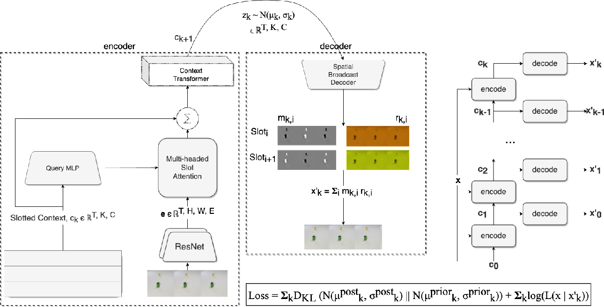

## Slot Transformer - for solving reasoning tasks (wip)

Implementation of the architecture used in a new paper out of deepmind leveraging <a href="https://arxiv.org/abs/2006.15055">slot attention</a> for iterative variational inference.

## Citations

```bibtex
@inproceedings{Faulkner2022SolvingRT,
    title   = {Solving Reasoning Tasks with a Slot Transformer},
    author  = {Ryan Faulkner and Daniel Zoran},
    year    = {2022}
}
```
